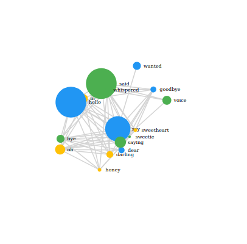
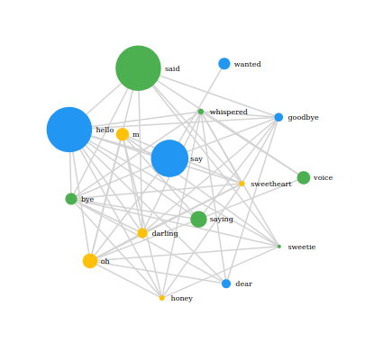

# react-d3-graph rearrange issue

## Bug replication

Follow the following steps to replicate the bug.

* Run ```npm install```
* Run ```npm start```
* Navigate to [http://localhost:3000](http://localhost:3000).
* The graph initially should be arranged similar to ```Figure 1```.
* Change the width of the window and observe the rearranging of the graph to a position similar to ```Figure 2```. The width change simply triggers a rerender of the graph.

### Figure 1



### Figure 2


## Cause 

For some reason when ```d3: {}``` is commented out in the file ```./src/networkGraph/index.tsx```, the graph behaves differently.
```ts
// The following line seems to be the source of the unexpected behaviour
d3: {}
```

## Available Scripts

In the project directory, you can run:

### `npm start`

Runs the app in the development mode.<br>
Open [http://localhost:3000](http://localhost:3000) to view it in the browser.

The page will reload if you make edits.<br>
You will also see any lint errors in the console.

### `npm test`

Launches the test runner in the interactive watch mode.<br>
See the section about [running tests](https://facebook.github.io/create-react-app/docs/running-tests) for more information.

### `npm run build`

Builds the app for production to the `build` folder.<br>
It correctly bundles React in production mode and optimizes the build for the best performance.

The build is minified and the filenames include the hashes.<br>
Your app is ready to be deployed!

See the section about [deployment](https://facebook.github.io/create-react-app/docs/deployment) for more information.
